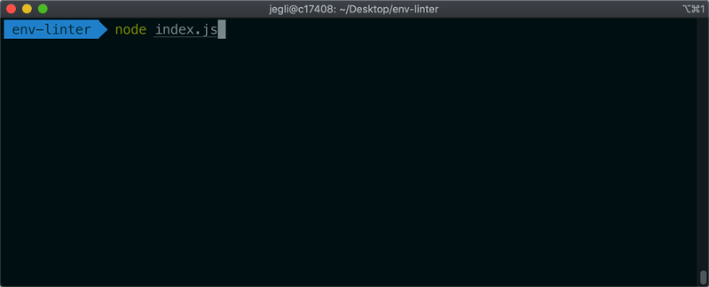

<div align="center">
    <h1>Env Linter</h1>
    <p>A bunch of CLI helper for our projects. Check versions, save-exact and hooks-installed.</p>

[](https://www.npmjs.com/package/@namics/env-linter)
[](https://travis-ci.org/namics/env-linter)
[](http://opensource.org/licenses/MIT)

</div>
<div style="max-width:640px;margin:0 auto;padding:20px 0 60px 0;">
    
</div>

## Usage

```json
{
	"postinstall": "env-linter --hooksInstalled --saveExact --versions 'node=12.x.x,npm=6.x.x'",
	"prestart": "env-linter --versions 'node=12.x.x,npm=6.x.x'",
	"lint-staged": {
		"**/package.json": ["env-linter --saveExact"]
	}
}
```

## API usage

```js
const { api } = require('@namics/env-linter');

await api({
	versions: 'node=12.x.x,npm=6.x.x',
	hooksInstalled: true,
	saveExact: true,
});
```

## Options

### -vs, --versions [string]

Checks the installed versions of global packages or programs like node, npm, yo, etc. against a required version.
For example calling `env-linter --versions 'node=12.x.x'` will assure that version 12 of node is being used.
env-linter will stop any further process-execution if a package or program does not satisfy the required version.

Calling env-linter with `--versions` but without any arguments will compare the installed node-version with the node-version from the .node-version file.

In any case, the used node version is compared to the list of [official node-releases](https://nodejs.org/dist/index.json) and process-execution is stopped if the used npm version is older than the npm version that node comes with. This is a combination that can only occur with certain node-version managers.

### -h, --hooksInstalled

Checks if git-hooks are installed (i.e. husky installed). env-linter will stop any further process-execution if git-hooks are not installed.

### -s, --saveExact

Checks if the npm option `save-exact` is enabled, either through a .npmrc file in the project or in the user-directory. env-linter will stop any further process-execution if save-exact is disabled. After a successful test of the `save-exact`
flag, it will continue to parse your `package.json` to check if all version definitions are fitting our standards (no approximate versions eg. tilde `~` or caret `^`), no star `*` wildcard and no tarball embedds via `https://`).

## License

[MIT License](./LICENSE)
